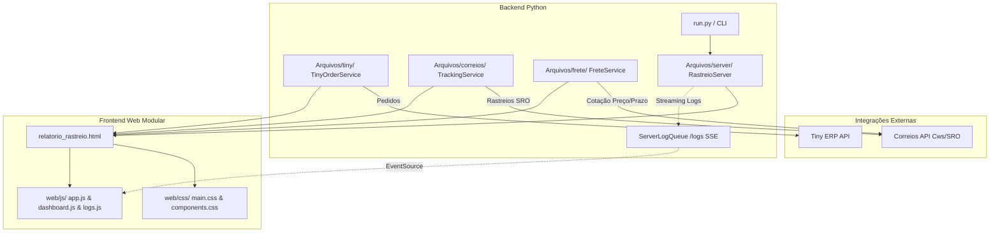

# 📦 Rastreio Correios & Tiny ERP

[](https://github.com/yansilva/Rastreio-correios/actions/workflows/ci.yml)
[](https://www.gitguard.com.br/yansilva)
[]()
[](https://github.com/astral-sh/ruff)
[]()

Sistema automatizado em Python para automação de rastreamento de encomendas, auditoria de prazos de entrega e cálculo/cotação de fretes via API oficial dos Correios, integrado ao **Tiny ERP**.

---

## ⚡ Quickstart para Avaliadores e Recrutadores (Em 30 Segundos)

Você pode testar a aplicação completa **imediatamente**, com dados simulados e sem precisar de credenciais privadas:

```bash
# 1. Clonar o repositório
git clone https://github.com/yansilva/Rastreio-correios.git
cd Rastreio-correios

# 2. Instalar as dependências de execução
pip install -r requirements.txt

# 3. Executar em Modo Demonstração (Portfólio)
python run.py --demo
```

O painel será aberto automaticamente no navegador em `http://localhost:8000`, populado com 10 pedidos cobrindo todos os cenários operacionais (em trânsito, atrasados com alerta, aguardando retirada, entregues e devolvidos), com suporte a busca instantânea, filtros por status e Dark Mode.

---

## 🚀 Funcionalidades Principais

- **Sincronização com Tiny ERP:** Busca pedidos ativos, verifica status e códigos de rastreamento pendentes ou expedidos recentemente.
- **Rastreamento Correios em Lote:** Consulta automática via API oficial dos Correios (autenticação por contrato e Bearer token com auto-renovação), destacando objetos aguardando retirada ou com atrasos.
- **Auditoria de Entregas & Prazos:** Identificação e destaque de pedidos com atraso na entrega em relação ao prazo prometido pelos Correios.
- **Painel Web Local Interativo:** Dashboard embutido com interface visual moderna, busca instantânea client-side por pedido `#123`, cliente, rastreio ou cidade, filtros por chips de status, modo escuro com persistência em `localStorage` e streaming de logs em tempo real via Server-Sent Events (SSE).
- **Cotação e Comparação de Fretes:** Simulação e conferência de preços e prazos (SEDEX, PAC, Mini Envios) direto com a API dos Correios.
- **Alertas Automatizados:** Geração de relatórios com alertas visuais para divergências e prazos estendidos.
- **Validação e Qualidade Contínua (CI):** Pipeline automatizado no GitHub Actions para cada push e pull request validando compilação, lint (Ruff) e testes em matriz Python 3.11 e 3.12.
- **Diagnóstico Integrado (`--check`):** Comando CLI para verificação instantânea da saúde do ambiente, dependências e configurações.

---

## 🏛️ Destaques de Engenharia de Software

| Pilar | Abordagem Implementada |
|---|---|
| **Arquitetura** | Camadas concêntricas desacopladas (`tiny/`, `correios/`, `frete/`, `server/`, `web/`) orientadas a Single Responsibility Principle (SRP). |
| **Testes Automatizados** | **147 testes unitários** rápidos e 100% mockados (sem chamadas de rede ou credenciais reais), executando em ~2 segundos. |
| **Segurança Defensiva** | Proteção canônica anti-path traversal no servidor HTTP, bloqueio estrito de arquivos sensíveis (`.env`, `.git`, `.py`) e mascaramento automático de credenciais no streaming SSE. |
| **Frontend Vanilla Moderno** | Design tokens CSS (`:root` e `[data-theme="dark"]`), zero dependências de build/npm, busca instantânea client-side e navegação por abas. |
| **Resiliência HTTP** | Timeouts explícitos em todas as requisições externas, auto-renovação de tokens 401 e tolerância a indisponibilidade pontual de serviços dos Correios. |
| **Qualidade & CI** | Análise estática com Ruff (0 erros), compilação com `compileall` e GitHub Actions contínuo. |

---

## 🔄 Fluxo de Arquitetura



---

## 📁 Estrutura do Projeto

```text
Rastreio-correios/
├── .github/
│   └── workflows/
│       └── ci.yml           # Pipeline automatizado de CI (Python 3.11 e 3.12)
├── run.py                   # Ponto de entrada principal com suporte a CLI (--demo, --check)
├── ABRIR_PAINEL.bat         # Inicializador rápido para Windows (com auto-detecção de venv)
├── abrir_painel.sh          # Inicializador rápido para Linux e macOS
├── pyproject.toml           # Configurações do projeto, Ruff, Pytest e Cobertura
├── requirements.txt         # Dependências de produção
├── requirements-dev.txt     # Ferramentas de desenvolvimento, lint e testes
├── .env.example             # Modelo de configuração das variáveis de ambiente
├── .gitignore               # Arquivos e pastas ignorados pelo Git
├── README.md                # Documentação do projeto
├── docs/
│   └── architecture.md      # Documentação técnica aprofundada da arquitetura
├── web/                     # Frontend estático modular (HTML, CSS e JavaScript)
│   ├── css/
│   │   ├── main.css         # Design tokens, variáveis CSS (:root / dark), tipografia e reset
│   │   └── components.css   # Cards de pedidos, linha do tempo, tabela de atrasados, console SSE
│   └── js/
│       ├── app.js           # Gerenciamento de tema claro/escuro e sistema Toast
│       ├── dashboard.js     # Busca instantânea client-side e filtros dinâmicos por status
│       └── logs.js          # Streaming SSE de logs, cooldown e contagem regressiva
├── tests/                   # Suíte de testes automatizados (147 testes mockados)
│   ├── test_tiny.py         # Testes da camada Tiny ERP (11 testes)
│   ├── test_correios.py     # Testes da camada Correios SRO (20 testes)
│   ├── test_frete.py        # Testes da camada de Frete (67 testes)
│   ├── test_server.py       # Testes da camada do Servidor (35 testes)
│   ├── test_frontend.py     # Testes dos assets web e integração de templates (7 testes)
│   └── test_demo.py         # Testes do modo demonstração, onboarding e diagnóstico (4 testes)
└── Arquivos/
    ├── tiny/                # Pacote modular Tiny ERP (client, service, models, config)
    ├── correios/            # Pacote modular Correios SRO (client, tracking, models)
    ├── frete/               # Pacote modular Frete (client, service, report, models)
    ├── server/              # Pacote modular Servidor HTTP (config, security, handler, service)
    ├── demo_data.py         # Gerador de dados sintéticos realistas para demonstração
    ├── servidor_rastreio.py # Fachada de compatibilidade do servidor
    ├── consulta_correios.py # Orquestrador de rastreamento e renderização de relatórios
    ├── consulta_frete.py    # Orquestrador de cotação de frete
    └── tiny_rastreio.py     # Orquestrador de coleta de pedidos do Tiny
```

---

## 💻 Opções da Linha de Comando (`run.py`)

| Comando / Opção | Descrição |
|---|---|
| `python run.py` | Inicia o servidor HTTP padrão na porta 8000 e abre o navegador. |
| `python run.py --demo` | **Modo Demonstração:** Gera instantaneamente dados simulados e abre o painel. |
| `python run.py --check` | **Diagnóstico:** Valida versão do Python, dependências instaladas e variáveis de ambiente. |
| `python run.py --port 8080` | Define porta TCP customizada para o servidor web. |
| `python run.py --host 0.0.0.0` | Expõe o servidor na rede local ou para contêineres Docker. |
| `python run.py --no-browser` | Inicia o servidor sem abrir o navegador web automaticamente (ideal para CI/Docker). |

---

## ⚙️ Instalação e Configuração para Produção

### 1. Pré-requisitos
- Python 3.11 ou superior instalado.
- Acesso à API do Tiny ERP (Token de API).
- Contrato ativo nos Correios e código de acesso à API dos Correios (Portal Cws).

### 2. Clonar e Configurar Ambiente
```bash
git clone https://github.com/yansilva/Rastreio-correios.git
cd Rastreio-correios

python -m venv venv
# No Windows:
venv\Scripts\activate
# No Linux/macOS:
source venv/bin/activate

pip install -r requirements.txt
```

### 3. Configurar as Variáveis de Ambiente
Copie o arquivo `.env.example` para `.env` e preencha com suas credenciais:
```bash
# No Windows:
copy .env.example .env
# No Linux/macOS:
cp .env.example .env
```

Edite o arquivo `.env`:
```env
# Tiny ERP
TOKEN_TINY=seu_token_aqui

# Correios API
ID_CORREIOS=seu_id_ou_cnpj_aqui
CONTRATO=seu_numero_contrato_aqui
CODIGO_ACESSO=seu_codigo_de_acesso_aqui

# Configuração de envio
CEP_ORIGEM=seu_cep_origem_aqui

# Servidor (Opcional - padrão: 127.0.0.1:8000)
SERVER_HOST=127.0.0.1
SERVER_PORT=8000
```

Valide o ambiente configurado:
```bash
python run.py --check
```

---

## 🧪 Qualidade e Testes Automatizados

O projeto conta com suíte de testes automatizados abrangente e 100% mockada (sem chamadas de rede ou credenciais reais), validada continuamente pelo GitHub Actions:

### 1. Executar os Testes Unitários
```bash
python -m pytest tests/ -v
```

### 2. Executar Cobertura de Código
```bash
python -m pytest tests/ --cov=Arquivos --cov-report=term-missing
```

### 3. Executar Análise Estática (Ruff)
```bash
ruff check .
```

### 4. Validar Sintaxe de Todos os Arquivos
```bash
python -m compileall Arquivos run.py tests
```

---

## 🔒 Segurança e Boas Práticas

- **Zero Secrets em Versionamento:** O repositório não armazena credenciais, tokens ou dados pessoais de clientes.
- **Proteção Anti-Path Traversal:** O servidor HTTP valida canonicamente os caminhos e bloqueia acesso a arquivos fora da raiz, arquivos ocultos (`.env`, `.git`) ou código-fonte (`.py`).
- **Sanitização de Streaming:** Tokens e chaves de API são interceptados e mascarados antes do envio ao navegador via SSE.
- **Mocks 100% Isolados no CI:** O pipeline no GitHub Actions é completamente auto-contido e não necessita de secrets reais para validar o projeto.
- Para detalhes arquiteturais completos, consulte [docs/architecture.md](docs/architecture.md).

---

## 📄 Licença

Projeto desenvolvido para uso operacional e portfólio profissional de engenharia de software.
